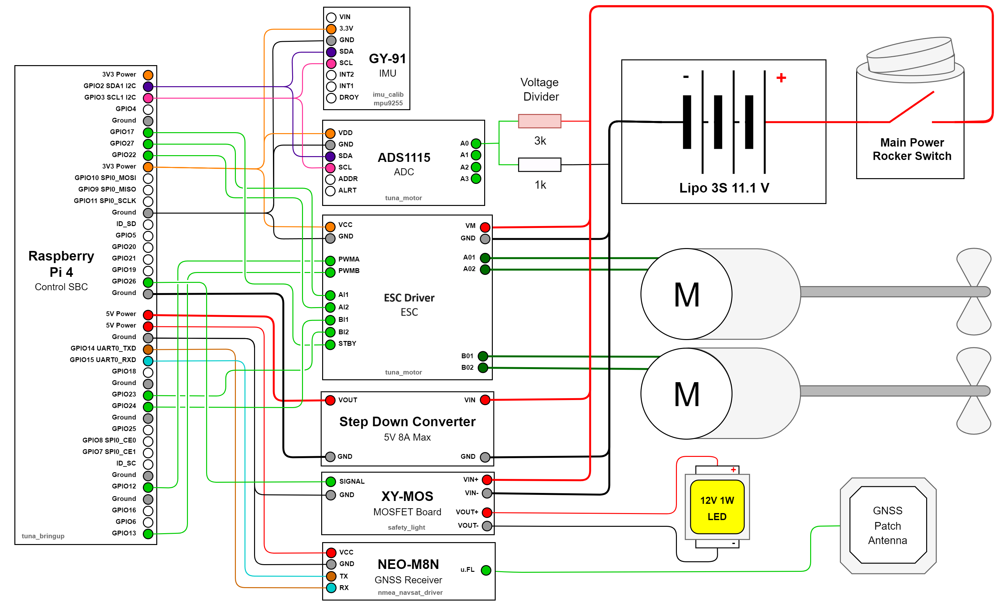

# [Unmanned Suface Vehicle](https://github.com/BKG-Robocon-team/Unmanned-Surface-Vehicle) - Robot Project

 
 
 
 

> **You can view the demo [here](#).**

The Unmanned Surface Vehicle (USV) is a robotic system that autonomously navigates a predefined route and monitors underwater data.

### Goals of this project :

- **_To reduce the wastage of water across the city_**
- **_To provide better water supply to the people_**

The IoT(Hardware) components required are:

- **Raspberry PI**
- **Neo N8M**
- **ADS1115**
- **GY-91 IMU Sensor**
- **ESC Brushless controller**

## Getting Started

## Circuit Diagram

## Simulation in Gazebo

## Mentors

| GitHub Usernames                                      | Domain                     |
| ----------------------------------------------------- | -------------------------- |
| [@hocj2me](https://github.com/hocj2me)                | Full Stack + Documentation |

## Useful Resources

[Project Definition Document](https://docs.google.com/spreadsheets/d/1eam0kNJS5JAPLBJ7-bUTmjU_azjv8y5DEV80axiB__I/edit?fbclid=IwZXh0bgNhZW0CMTAAAR0jDvYxtVIcWbFSndvCd7W_tJsVNXhYPtu7VgXbZhjSy1PIzmAlz8DhPZc_aem_AZN6eFqjrJJa_lzEBjXCGE1p7S4CD7Hc8l7LTGk6ziRQSd0BwNeDH95Rkw0vcufiSmnsjPqBJq4vCUlszNMsk_QV#gid=1359562578)

